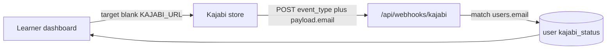

# Kajabi dumb handoff integration

Minimal LMS integration between the BIRE platform and Kajabi. No SSO, no Kajabi REST API, no magic-link provisioning.

## What we are NOT building

- Single Sign-On (SSO) between BIRE and Kajabi
- Kajabi REST API calls for granular course progress
- Programmatic user provisioning or magic links
- Admin UI for Kajabi user mapping
- Deletion of legacy `kajabi_user_mapping` / `kajabi_progress_webhooks` tables (kept for MEL reporting compatibility)

## Architecture

1. **Link out** — Learner opens `/dashboard/learning`, clicks a plain `<a>` to `KAJABI_URL` in a new tab.
2. **Passive webhook** — Kajabi POSTs to `/api/webhooks/kajabi` with `event_type` and `payload.email`. We match `users.email` and update status columns.



## Data model

Columns on `user` table (`db/schema.ts`):

| Column | Type | Default | Notes |
|--------|------|---------|-------|
| `kajabi_status` | enum | `NOT_STARTED` | `NOT_STARTED`, `REGISTERED`, `COMPLETED` |
| `kajabi_registered_at` | timestamp | null | Set on `offer.granted` |
| `kajabi_completed_at` | timestamp | null | Set on `course.completed` |

Status machine:

- `NOT_STARTED` → `REGISTERED` when `event_type === 'offer.granted'`
- `REGISTERED` → `COMPLETED` when `event_type === 'course.completed'`
- `COMPLETED` is never demoted by `offer.granted`

## Environment variables

| Variable | Required | Description |
|----------|----------|-------------|
| `KAJABI_URL` | Yes (prod) | External Kajabi store/portal URL for the "Access Kajabi Learning Portal" button |
| `KAJABI_WEBHOOK_SECRET` | No | If set, webhook requires matching header (`x-kajabi-secret`, `x-webhook-secret`, or `Authorization: Bearer <secret>`) |
| `POSTGRES_URL` | Yes | Database connection (existing) |

## Build sequence

Implement one feature at a time. Do not skip ahead.

### Feature 0 — This document

- [x] `src/docs/kajabi-dumb-handoff.md`

### Feature 1 — Schema + migration

**Files:** `db/schema.ts`, `drizzle/00XX_*.sql`

1. Add `kajabiStatusEnum` pgEnum.
2. Add `kajabiStatus`, `kajabiRegisteredAt`, `kajabiCompletedAt` to `users`.
3. Generate and run migration:

```bash
pnpm db:generate
pnpm db:migrate
```

**Done when:** Migration applied; existing users default to `NOT_STARTED`.

### Feature 2 — Dashboard UI

**Files:**

- `src/app/dashboard/layout.tsx` — auth guard
- `src/app/dashboard/learning/page.tsx` — Enterprise Learning Center card
- `src/app/profile/page.tsx` — link to `/dashboard/learning`

**UI requirements:**

- Card title: "Enterprise Learning Center"
- Status badge: Gray (Not Started), Yellow (Registered), Green (Completed)
- Primary button: `<a target="_blank" rel="noopener noreferrer" href={KAJABI_URL}>`
- Warning text below button about separate Kajabi account/login
- If `KAJABI_URL` is unset, show notice instead of broken link

**Done when:** Authenticated user can open `/dashboard/learning`, see status badge, and click out to Kajabi.

### Feature 3 — Webhook listener

**Files:** `src/app/api/webhooks/kajabi/route.ts`

**Expected payload:**

```json
{
  "event_type": "offer.granted",
  "payload": {
    "email": "learner@example.com"
  }
}
```

**Logic:**

1. Optional secret header check.
2. Parse JSON; invalid JSON → 400.
3. Extract `event_type` and `payload.email`; missing → 200 `{ ignored: true }`.
4. Find user by case-insensitive email; no match → 200 OK.
5. `offer.granted` → `REGISTERED` + `kajabi_registered_at` (only from `NOT_STARTED`).
6. `course.completed` → `COMPLETED` + `kajabi_completed_at`.
7. Other events → 200 ignore.
8. DB error → 500.

**Done when:** Webhook updates user status from test payloads; always returns 200 on success/ignore.

## Kajabi admin setup

Step-by-step Kajabi UI, env vars, and troubleshooting: **[kajabi-webhook-setup.md](./kajabi-webhook-setup.md)**.

Summary:

1. Restored Growth/Pro plan; use the **site** Dashboard (not Account Details).
2. Offer → More → Webhooks → **Purchase Webhook URL** (outbound only).
3. URL: `https://<your-public-domain>/api/webhooks/kajabi`
4. Payload should include `event_type` (`offer.granted` / `course.completed`) and `payload.email`.
5. Optional: `KAJABI_WEBHOOK_SECRET` + header `x-kajabi-secret`.

## Local testing

### Webhook — offer granted

```bash
curl -X POST http://localhost:3000/api/webhooks/kajabi \
  -H "Content-Type: application/json" \
  -H "x-kajabi-secret: your-secret" \
  -d '{"event_type":"offer.granted","payload":{"email":"test@example.com"}}'
```

Expected: `200` with `{ "ok": true }`. User `test@example.com` → `REGISTERED`.

### Webhook — course completed

```bash
curl -X POST http://localhost:3000/api/webhooks/kajabi \
  -H "Content-Type: application/json" \
  -d '{"event_type":"course.completed","payload":{"email":"test@example.com"}}'
```

Expected: `200`. User → `COMPLETED`, `kajabi_completed_at` set.

### Webhook — unknown email (graceful ignore)

```bash
curl -X POST http://localhost:3000/api/webhooks/kajabi \
  -H "Content-Type: application/json" \
  -d '{"event_type":"offer.granted","payload":{"email":"nobody@example.com"}}'
```

Expected: `200` (no error; user not found is ignored).

### Dashboard

1. Log in as a user with known email.
2. Visit `/dashboard/learning`.
3. Confirm badge reflects `kajabi_status`.
4. Click "Access Kajabi Learning Portal" — opens `KAJABI_URL` in new tab.

## Legacy tables (unchanged)

`kajabi_user_mapping` and `kajabi_progress_webhooks` remain in the schema. Under this design they are **not written to**. MEL reporting in `src/lib/mel/reporting-data.ts` may still query them; they will stay empty unless a future feature revives ID-based mapping.
