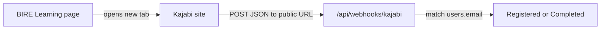

# Kajabi webhook setup guide

How to connect Kajabi so `/dashboard/learning` moves off **Not Started**. This is an operations guide, not an engineering spec. Architecture and code live in [kajabi-dumb-handoff.md](./kajabi-dumb-handoff.md).

## What this integration does

- The **Access Kajabi Learning Portal** button only opens Kajabi in a new tab. Signing in on Kajabi does **not** update BIRE.
- Status updates only when **Kajabi POSTs** to this app.
- There is **no SSO**, no Kajabi API key, and no magic-link env var.



## Env vars (this app)

Put these in `.env.local` (local) or the host’s env (production). Restart the Next.js process after changing them.

| Variable | Required? | Purpose |
|----------|-----------|---------|
| `KAJABI_URL` | Yes, for the button | Full URL of **your** Kajabi site or offer (not generic `https://app.kajabi.com` unless that is really the learner portal). |
| `KAJABI_WEBHOOK_SECRET` | Optional | Shared secret. If set, Kajabi must send it in `x-kajabi-secret`, `x-webhook-secret`, or `Authorization: Bearer <secret>`. Leave unset for first tests. |

You do **not** need Kajabi API keys, OAuth client IDs, or Account ID from **Account Details**.

## Kajabi plan

Webhooks are on **Growth** or **Pro**. If Account Settings shows **“Your Growth subscription has been cancelled”**, restore the plan first. Otherwise the webhook screens are missing or disabled.

Settings → **Subscription** → **Restore my account**.

## You are in the wrong place if…

You are on **Account Settings → Details** (first name, last name, Account ID). That is billing/profile.

Leave it: sidebar → **Dashboard**. You need the **site** admin (Sales, Offers, Products), not Account Details.

## Outbound vs inbound (do not mix these)

| Kind | Where | What it does | Use for BIRE? |
|------|--------|----------------|---------------|
| **Outbound** | Offer → Webhooks → **Purchase Webhook URL**, or Settings → Integrations & Webhooks | Kajabi **sends** events **to** our URL | **Yes** |
| **Inbound** | Offer → Webhooks → **Activation / Deactivation URL** | Other apps grant/revoke Kajabi access | **No** — do not copy these into `.env` |

## Step-by-step: add the outbound webhook

The endpoint Kajabi must call:

```text
https://YOUR-PUBLIC-DOMAIN/api/webhooks/kajabi
```

Replace `YOUR-PUBLIC-DOMAIN` with the live BIRE host (for example `https://bireprogram.org`).  
**Kajabi cannot reach `localhost`.** For local testing use a public tunnel (ngrok, Cloudflare Tunnel) pointed at the Next.js port (`pnpm dev` uses **3001**).

### Option A — one offer (simplest)

1. Open the Kajabi **site** Dashboard (not Account Details).
2. **Sales** → **Pricing** (or **Offers**).
3. Open the offer / course learners take.
4. **⋯** (More) → **Webhooks**.
5. Under **Outbound Webhooks**, paste the URL above into **Purchase Webhook URL**.
6. **Save**.
7. Click **Send Test** if Kajabi shows it.

### Option B — site-wide payments

1. **Settings** → **Integrations & Webhooks**.
2. **Create webhook**.
3. Event: **Payment Succeeded** or **Cart Purchase**.
4. Endpoint URL: the same `/api/webhooks/kajabi` URL (must be **HTTPS**).
5. **Add webhook**.

### Optional secret

If you set `KAJABI_WEBHOOK_SECRET` in the app, configure Kajabi to send that value in a custom header named `x-kajabi-secret`. If Kajabi cannot set custom headers, **leave the env unset** so POSTs are accepted.

## Payload this app understands

The listener is [`src/app/api/webhooks/kajabi/route.ts`](../app/api/webhooks/kajabi/route.ts).

It reads `event_type` **or** `event`, and email from `payload.email` (also `payload.member.email` / `payload.contact.email` / `payload.user.email`).

| Event value | BIRE badge |
|-------------|------------|
| `offer.granted` | **Registered** (only from Not Started) |
| `course.completed` | **Completed** |

Email must match the learner’s email on **this** app (case-insensitive). Unknown emails return `200` and change nothing.

Kajabi’s built-in **Purchase** webhook often sends a **purchase** event, not `offer.granted`, and **login never fires a webhook**. If **Send Test** hits the endpoint but the badge stays Not Started, copy the JSON Kajabi sent and map that event in the webhook (engineering change).

Ideal body (automations / Zapier / Make can send this):

```json
{
  "event_type": "offer.granted",
  "payload": {
    "email": "learner@example.com"
  }
}
```

Completed:

```json
{
  "event_type": "course.completed",
  "payload": {
    "email": "learner@example.com"
  }
}
```

## Local test (no Kajabi required)

Dev server: `pnpm dev` → port **3001**.

PowerShell (use the same email as the logged-in BIRE user):

```powershell
Invoke-RestMethod -Uri http://localhost:3001/api/webhooks/kajabi -Method POST -ContentType "application/json" -Body '{"event_type":"offer.granted","payload":{"email":"learner@example.com"}}'
```

Then refresh `/dashboard/learning`. Badge should be **Registered**.

Completed:

```powershell
Invoke-RestMethod -Uri http://localhost:3001/api/webhooks/kajabi -Method POST -ContentType "application/json" -Body '{"event_type":"course.completed","payload":{"email":"learner@example.com"}}'
```

Unknown email should still return `{ "ok": true }` with no user change.

## How to confirm it worked

1. Log in to BIRE as that user.
2. Open `/dashboard/learning`.
3. Badge: gray **Not Started** → yellow **Registered** → green **Completed**.
4. After a real Kajabi POST, **refresh** the page. It does not live-update.

## Checklist

- [ ] Growth/Pro restored (webhooks available)
- [ ] Working in **site** Dashboard, not Account Details
- [ ] `KAJABI_URL` is the learner-facing Kajabi site/offer URL
- [ ] Outbound URL is `https://<public-host>/api/webhooks/kajabi`
- [ ] Not using Activation / Deactivation URLs
- [ ] Kajabi **Send Test** or a purchase hits the URL
- [ ] JSON includes event + email that matches a BIRE user
- [ ] Learning page refreshed after the POST

## Troubleshooting

| Symptom | Likely cause |
|---------|----------------|
| Badge still Not Started after Kajabi login | Expected. Login is not a webhook. |
| No Webhooks menu in Kajabi | Cancelled plan, or you are on Account Details. |
| Kajabi cannot save the URL | Must be HTTPS (for site-wide hooks). Localhost is rejected. |
| `401 Unauthorized` | `KAJABI_WEBHOOK_SECRET` is set but Kajabi is not sending the header. Unset the env or add the header. |
| `{ "ignored": true }` | Missing event or email in the JSON. |
| `{ "ok": true }` but badge unchanged | Email does not match `user.email`, or event is not `offer.granted` / `course.completed`. |
| Works with PowerShell, not Kajabi | Kajabi is posting to the wrong host, or payload shape differs. |
